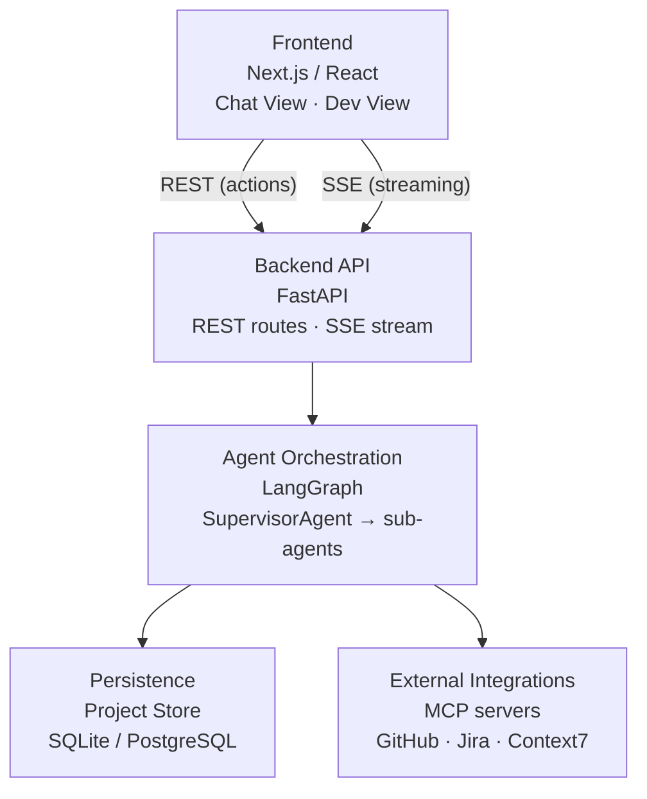
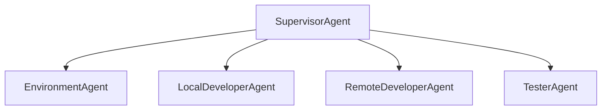
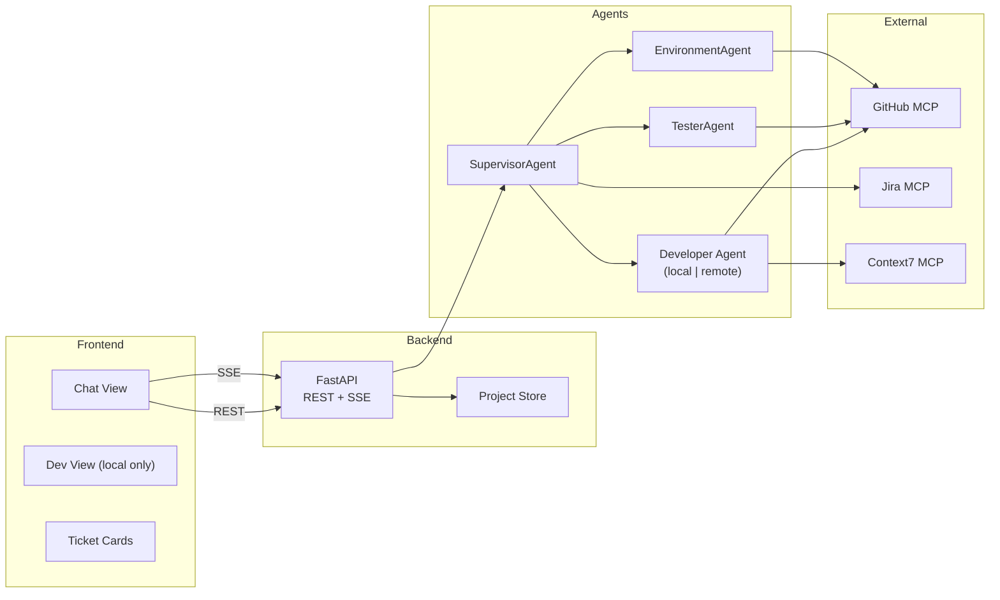

# Architecture Spine — ai-consultant

## Design Paradigm

**Layered + Supervisor-Worker Agent**

Four layers, strict dependency direction (each layer may only depend on layers below it):

```
Frontend (Next.js/React)
    ↓ REST + SSE
Backend API (FastAPI)
    ↓ async calls
Agent Orchestration (LangGraph — SupervisorAgent → sub-agents)
    ↓ reads/writes
Persistence + External Integrations (Project Store · MCP servers · GitHub · Jira · Context7)
```



Sub-agents are workers with no peer visibility — all coordination flows up through the Supervisor. The Supervisor is the only component that crosses all four layers.

## Invariants & Rules

### AD-1 — Strict agent hierarchy (Supervisor → sub-agents only)

- **Binds:** all agent implementations (CAP-2, CAP-5, FR-11, FR-15)
- **Prevents:** agent-to-agent direct calls, emergent parallel paths, untraceable execution state
- **Rule:** `SupervisorAgent` is the sole orchestrator. Sub-agents (`EnvironmentAgent`, `LocalDeveloperAgent`, `RemoteDeveloperAgent`, `TesterAgent`) never call each other. New agents are added as children of `SupervisorAgent`, registered in `SupervisorAgent.__init__()`. **[ADOPTED]**



### AD-2 — Global sequential execution lock

- **Binds:** execution engine, project store, SupervisorAgent (CAP-2, FR-11, PRD §5)
- **Prevents:** concurrent ticket execution across any project; merge conflicts; cross-ticket context corruption
- **Rule:** A process-level lock is acquired by `SupervisorAgent` before a ticket begins and released only after: test artifact written to project store AND ticket status updated AND branch committed/pushed. No second ticket starts, in any project, while the lock is held.

### AD-3 — MCPManager singleton

- **Binds:** all MCP tool loaders (CAP-8, CAP-1, CAP-11, CAP-12)
- **Prevents:** multiple connection pools, connection leaks, duplicate subprocess spawning
- **Rule:** All MCP connections go through `await MCPManager.get_instance()`. New MCP tool sources are registered inside `MCPManager.initialize()`, never called ad-hoc. `load_*_mcp_tools()` context managers yield from the already-initialized singleton — they do not open new connections. **[ADOPTED]**

### AD-4 — LLM-as-last-resort

- **Binds:** frontend action handlers, backend API routes (FR-8, FR-9, FR-26, CAP-10)
- **Prevents:** unnecessary LLM calls on UI state transitions; cost inflation; latency on accept/select/edit
- **Rule:** UI actions that do not require language understanding (Accept, checkbox select, field edit, dependency ordering) call backend REST endpoints directly — zero LLM invocation. The LLM is invoked only when reasoning or generation is required. Ticket Accept → direct API call. Dependency ordering → computed from graph, no LLM.

### AD-5 — Project isolation

- **Binds:** project store, agent memory, `SupervisorAgent.chat_history` (FR-2, FR-13, CAP-4)
- **Prevents:** cross-project data leakage; context pollution between projects
- **Rule:** Each project has a fully isolated store partition (agent memory, spec, ticket history, cost ledger). No shared mutable state between projects at any layer. Switching projects in the frontend loads a different store partition — never merges or shares agent memory across project boundaries.

### AD-6 — Test artifact gate (no ghost validation)

- **Binds:** `TesterAgent`, ticket state machine, project store (FR-17, CAP-6, SPEC constraint)
- **Prevents:** ghost validation; tickets marked Done without actual test execution
- **Rule:** `TesterAgent` writes a test artifact reference (log file path or assertion result) to the project store before any ticket transitions to `Done`. A missing artifact reference is a hard system error — not a silent pass. Ghost validation is detectable at infrastructure level.

### AD-7 — Streaming over polling

- **Binds:** backend API, frontend Chat View (FR-23, CAP-3, CAP-7)
- **Prevents:** batched agent output; silent execution gaps; UX dead zones
- **Rule:** Agent log lines and status updates are emitted via Server-Sent Events (SSE) from the backend as they are produced. The frontend subscribes to an SSE endpoint scoped to the active execution. No polling. Batch delivery after completion is a violation.

### AD-8 — Context7 grounding mandatory before code generation

- **Binds:** `LocalDeveloperAgent`, `RemoteDeveloperAgent` (FR-14, CAP-8)
- **Prevents:** hallucinated APIs; code referencing deprecated or non-existent library versions
- **Rule:** Every code generation step in a developer agent is preceded by a Context7 MCP query for the target library/framework. The query result is incorporated into the generation prompt. Skipping this step is a violation regardless of confidence.

### AD-9 — Async throughout the agent layer

- **Binds:** all agent executors, all MCP tool calls, backend API handlers (project-context.md)
- **Prevents:** event-loop blocking; sync/async mixing; deadlocks on concurrent MCP I/O
- **Rule:** All agent invocations use `await agent_executor.ainvoke(...)`. All backend API route handlers are `async def`. No synchronous LLM or agent executor calls anywhere in the agent orchestration layer. **[ADOPTED]**

### AD-10 — Frontend-backend boundary: REST + SSE only

- **Binds:** Next.js frontend, FastAPI backend (FR-22–FR-26, CAP-7, CAP-9)
- **Prevents:** direct DB access from the browser; tight frontend-backend coupling; bypassed project isolation
- **Rule:** The frontend communicates with the backend exclusively via REST (for actions) and SSE (for streaming). No direct access to the project store, agent orchestration layer, or MCP servers from the browser. Backend owns all state mutations.

### AD-11 — BMad pipelines via subprocess, output bridged to SSE

- **Binds:** SupervisorAgent brainstorm/spec-review flows (FR-4, FR-5, CAP-1)
- **Prevents:** blocking the async agent loop; silent pipeline failures
- **Rule:** BMad pipelines (brainstorm, spec validation) are invoked as Python subprocesses from the backend. Subprocess stdout is captured and bridged to the active SSE stream so the user sees output in real time. **[ASSUMPTION: exact subprocess↔SSE wiring is an architecture spike — see OQ-2 in Deferred.]**

### AD-12 — Dual execution mode via `AGENT_MODE` env var

- **Binds:** developer agent selection, workspace management (FR-24, CAP-11, CAP-12)
- **Prevents:** ambiguity about which developer agent runs; accidental disk writes in remote mode
- **Rule:** `AGENT_MODE=local` → `LocalDeveloperAgent` (clones repo to `workspaces/`, disk-based). `AGENT_MODE=remote` (default) → `RemoteDeveloperAgent` (GitHub MCP only, no local clone). Dev View is only available in local mode. **[ADOPTED]**

### AD-13 — Config from env vars only

- **Binds:** all modules, all agents (project-context.md)
- **Prevents:** hardcoded credentials; config scattered across modules; env-specific drift
- **Rule:** `load_dotenv()` is called exactly once at `main.py` entry point. All modules read config via `os.environ.get("KEY", "default")`. Credentials never appear in source. Model names, API keys, workspace paths, and Jira identifiers are all env-var-driven. **[ADOPTED]**

### AD-14 — Project store: PostgreSQL for all deployment paths

- **Binds:** persistence layer, project store implementation, backend store/ module (FR-1–FR-3, FR-13)
- **Prevents:** dual-engine complexity; SQLite-only query assumptions that break the Docker path
- **Rule:** PostgreSQL is the single project store engine for both the uv/pip path and the Docker image path. uv/pip users provision their own PostgreSQL instance; the Docker image bundles one. No SQLite fallback.

## Consistency Conventions

| Concern | Convention |
| --- | --- |
| Agent naming | `<Role>Agent` class (e.g., `SupervisorAgent`, `TesterAgent`); file `agents/<role>_agent.py` |
| MCP loader naming | `load_<service>_mcp_tools()` async context manager; registered in `MCPManager.initialize()` |
| Tool decoration | `tools/` functions are plain Python; wrapped with `@tool` + docstring inside agent modules — never in `tools/` directly |
| Branch naming | Local mode: `feature-local/<ticket-id>`; Remote mode: `feature/<ticket-id>` (slashes/hashes → hyphens) |
| Env var casing | `UPPER_SNAKE_CASE` for all env vars; `os.environ.get("KEY", "default")` everywhere |
| Error surfaces | All agent failures surface to `SupervisorAgent`; Supervisor escalates to Chat View — never silent |
| Gemini response guard | Always check `isinstance(content, list)` before reading `.content` from Gemini responses |
| Ticket state machine | States: `Pending → In Progress → Done \| Error \| Agent Blocked`; transitions only through project store write |
| LLM call logging | Every LLM call records token count to the project's cost ledger before returning |
| Test file location | `tests/test_<feature>.py`; integration/smoke tests at root (`test_*.py`); pytest only |

## Stack

| Name | Version |
| --- | --- |
| Python | 3.9+ |
| LangGraph (`langgraph`) | latest stable |
| LangChain (`langchain`, `langchain-core`) | latest stable |
| `langchain-google-genai` | latest stable |
| Google Gemini — routing/analysis (`TICKET_MODEL`) | gemini-2.5-flash (default) |
| Google Gemini — code generation (`CODING_MODEL`) | gemini-3.1-pro-preview (default) |
| FastAPI | latest stable **[ASSUMPTION]** |
| Next.js | 14+ **[ASSUMPTION — verify current stable]** |
| React | 18+ |
| MCP / `langchain-mcp-adapters` | latest stable |
| GitPython | latest stable |
| python-dotenv | latest stable |
| pytest | latest stable |
| PostgreSQL | latest stable (both uv/pip and Docker paths) |

## Structural Seed

```text
ai-consultant/
  agents/                  # LangGraph ReAct agents (SupervisorAgent + sub-agents)
    main_agent.py          # SupervisorAgent
    developer_agent.py     # RemoteDeveloperAgent
    local_developer_agent.py  # LocalDeveloperAgent
    environment_agent.py   # EnvironmentAgent
    tester_agent.py        # TesterAgent
  tools/                   # Plain Python helpers + MCP loaders (not @tool-decorated here)
    mcp_loader.py          # MCPManager singleton
    github_mcp.py
    jira_mcp.py
    context7_mcp.py
    file_ops.py
    ticket_manager.py
  backend/                 # FastAPI server, REST routes, SSE streaming [ASSUMPTION: to be created]
    api/
      routes/              # /projects, /tickets, /execute, /stream (SSE)
    store/                 # Project store access layer (PostgreSQL)
  frontend/                # Next.js app [ASSUMPTION: to be created]
    app/
      components/
        ChatView/           # Hybrid chat + structured component surface
        DevView/            # Live file tree (local mode only)
        TicketCard/         # Inline ticket card with Accept / edit controls
    lib/
      api/                  # REST client
      sse/                  # SSE subscription hook
  workspaces/              # Cloned repos in local mode — gitignored
  tests/                   # pytest unit tests
  main.py                  # Entry point: load_dotenv(), MCPManager.initialize(), logging setup
  requirements.txt
```



## Capability → Architecture Map

| Capability | Lives in | Governed by |
| --- | --- | --- |
| CAP-1: Spec → Jira tickets | SupervisorAgent + Jira MCP + BMad subprocess | AD-1, AD-3, AD-11 |
| CAP-2: Sequential ticket execution | SupervisorAgent execution loop | AD-1, AD-2 |
| CAP-3: Live thought log stream | Backend SSE → Chat View | AD-7, AD-10 |
| CAP-4: Cross-session project memory | Project Store (isolated per project) | AD-5 |
| CAP-5: Agent Pause on uncertainty | **Cut from v1** — agent pause feature removed from development plan | — |
| CAP-6: Test artifact, no ghost validation | TesterAgent + ticket state machine | AD-6 |
| CAP-7: PM dashboard (Chat View) | Frontend Chat View + SSE | AD-4, AD-7, AD-10 |
| CAP-8: Context7 grounding | DeveloperAgent (local + remote) | AD-8, AD-3 |
| CAP-9: Dual view toggle (Dev / PM) | Frontend — view state only, no agent impact | AD-10 |
| CAP-10: Approval gates (LLM-as-last-resort) | Frontend Ticket Cards + Backend REST | AD-4, AD-10 |
| CAP-11: Local mode live file tree | Dev View + LocalDeveloperAgent + workspaces/ | AD-12, AD-10 |
| CAP-12: Remote mode (logs only) | RemoteDeveloperAgent + GitHub MCP | AD-12, AD-3 |

## Deferred

| Item | Reason deferred | Revisit condition |
| --- | --- | --- |
| BMad subprocess ↔ SSE wiring (OQ-2) | Mechanism for piping subprocess stdout into SSE stream not defined; research required | Before FR-4 / FR-5 stories |
| Agent Pause feature (FR-15, FR-16, CAP-5) | **Removed from development plan.** Agents proceed or fail — no pause-for-user-input flow in v1. | Not revisited unless explicitly re-added to scope |
| Non-Gemini LLM backend abstraction | Out of scope v1; low-cost abstraction layer noted for v2 (PRD §6.2) | Post-v1 |
| Frontend framework version pinning | Next.js 14+ assumed; verify current stable before frontend epic | Start of frontend epic |
| Per-project concurrent execution | Explicit non-goal for v1; global lock is the rule | Post-v1 if demand warrants |
| Web-based code editor in Dev View | Out of scope v1; Dev View is read-only file tree | Post-v1 |
| Cost estimation price table | Published Gemini prices used; needs refresh mechanism as prices change | Tracked as FR-25 implementation detail |
